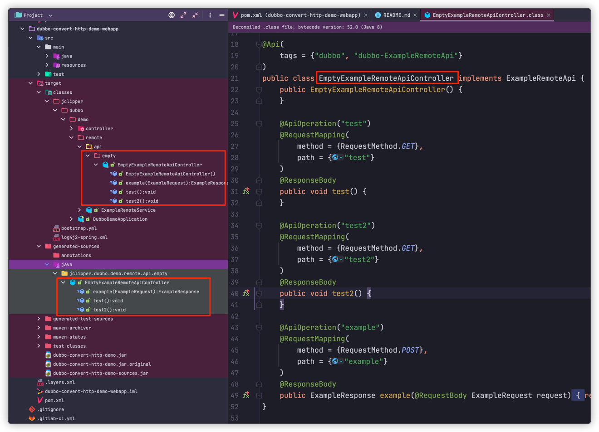
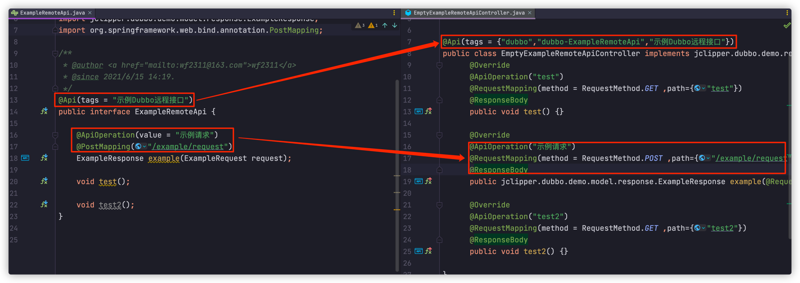
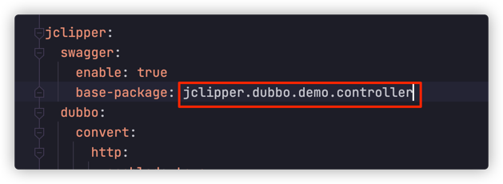
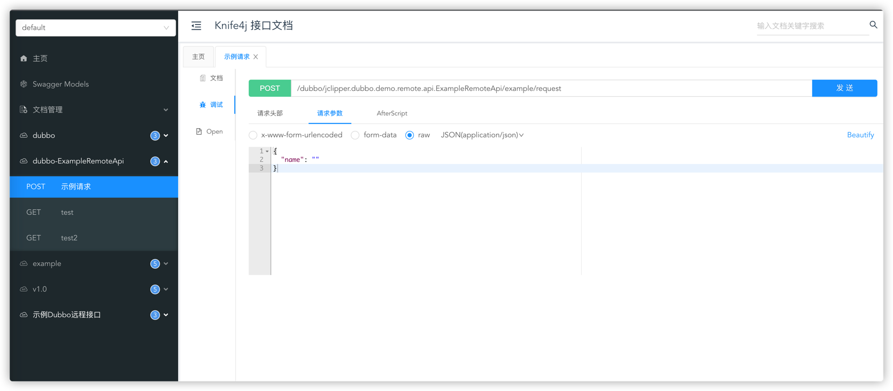
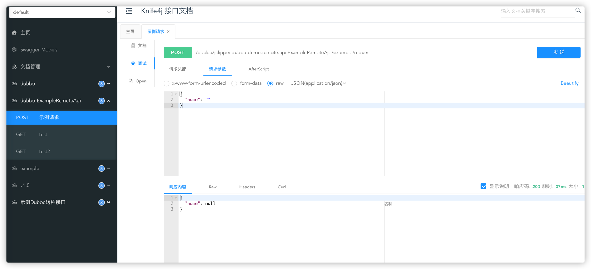
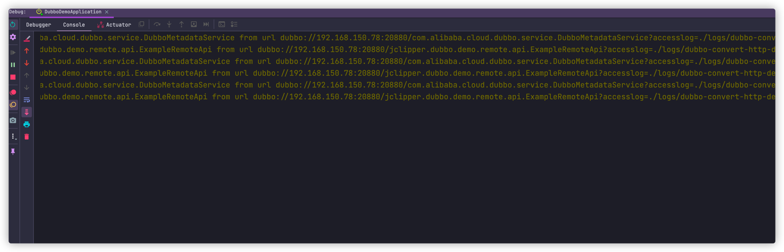
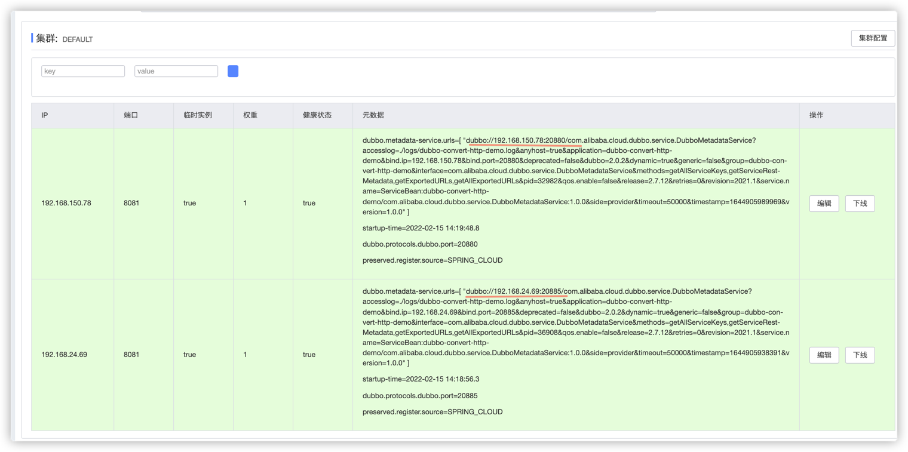
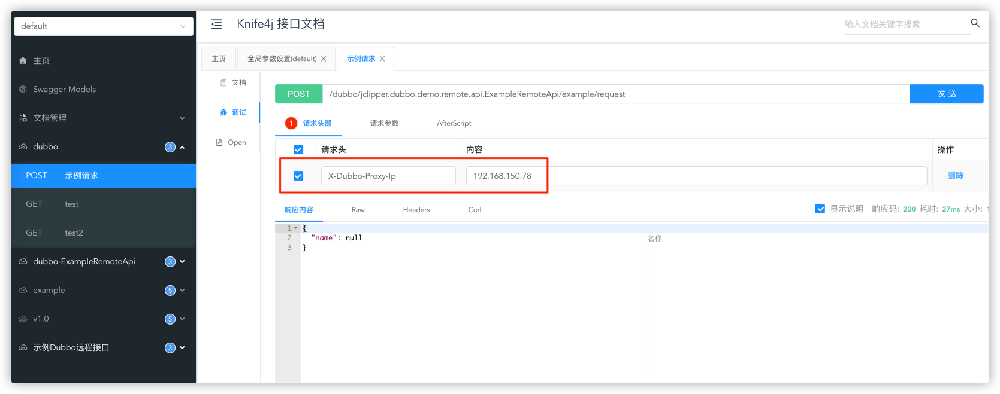
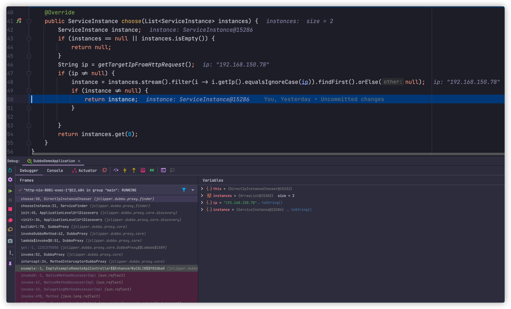

# 使用教程
以 [dubbo-convert-http-demo](https://github.com/j-clipper/dubbo-convert-http-demo) 项目为示例
## 模块说明
- dubbo-convert-http-demo-remote-api 为dubbo接口定义模块
- dubbo-convert-http-demo-webapp 为webapp模块
## dubbo api空实现类生成
### 在dubbo-convert-http-demo-webapp的 pom.xml文件中添加配置插件
```xml
<plugin>
    <groupId>com.wf2311.jclipper</groupId>
    <artifactId>generate-default-springmvc-impl-maven-plugin</artifactId>
    <version>2022.1-SNAPSHOT</version>
    <configuration>
        <scanPackages>
            <scanPackage>jclipper.dubbo.demo.remote.api</scanPackage>
        </scanPackages>
        <enable>true</enable>
    </configuration>
    <executions>
        <execution>
            <goals>
                <goal>generate-default-springmvc-impl</goal>
            </goals>
        </execution>
    </executions>
</plugin>
```

其中`scanPackage`的值要扫描的dubbo接口所在包路径，支持声明多个；

### 测试
在项目下运行`mvn -DskipTests clean install`命令


target下的`generated-sources/java`目录下会生成dubbo-api模块下接口对应的`空模板实现类`，同时会编译到`classes`目录中。

生成的实现类中的swagger和springmvc注解会进行继承，如果没有的话则会默认取类或方法名


插件`generate-default-springmvc-impl-maven-plugin`的完整配置参数如下：

完整配置：
```xml
<configuration>
    <scanPackages>
        <!-- 要扫描的包路径 -->
        <scanPackage>要扫描的包路径1</scanPackage>
        <scanPackage>要扫描的包路径2</scanPackage>
    </scanPackages>
    <includeInterfaces>
        <!-- 包含的接口路径 -->
        <includeInterface>包含的接口路径1</includeInterface>
        <includeInterface>包含的接口路径2</includeInterface>
    </includeInterfaces>
    <excludeInterfaces>
        <!-- 要排除的接口路径，会从scanPackages和includeInterfaces中进行排除 -->
        <excludeInterface>要排除的接口路径1</excludeInterface>
        <excludeInterface>要排除的接口路径2</excludeInterface>
    </excludeInterfaces>
    <classNamePostfix>生成实现类的前缀，默认为Empty</classNamePostfix>
    <classNamePrefix>生成实现类的前缀，默认为Controller</classNamePrefix>
    <targetPackage>生成实现类的包路径，指定targetSubPackage时此配置失效</targetPackage>
    <targetSubPackage>生成实现类相对于接口所在包的子路径</targetSubPackage>
    <outputDirectory>生成实现类存放的目录，默认为${project.build.directory}/generated-sources/java,不建议修改</outputDirectory>
</configuration>
```

## 将dubbo接口以http的方式为springmvc中
### 引入依赖
在dubbo-convert-http-demo-webapp的pom.xml引入依赖：
```xml
<dependency>
    <groupId>com.wf2311.jclipper</groupId>
    <artifactId>dubbo-convert-http-spring-boot-starter</artifactId>
    <version>2022.1-SNAPSHOT</version>
</dependency>
```
### 配置更改
`bootstrap.yml`或`application.yml`中添加配置：
```yaml;
jclipper:
   dubbo:
     convert:
       http:
         enabled: true # 默认为false，为true表示开发测试环境启用dubbo转http功能，生产环境勿启用此参数
         scan-packages:
           - 要扫描的dubbo接口所在包路径，支持多个
         application: ${spring.application.name}
```

### swagger包扫描路径改动
例如，在dubbo-convert-http-demo项目中，原先配置的swagger包扫描路径是`jclipper.dubbo.demo.controller`


为了同时扫描的dubbo接口所在包路径，需要取其公共父包路径`jclipper.dubbo.demo`或`jclipper.dubbo`

## 验证
### 接口调用
1. 查看swagger界面
   
2. 进行接口调用
   
   这时查看服务日志，可以看到dubbo调用信息
   

### 指定节点进行调用
如下图所示，dubbo-convert-http-demo服务有两个注册实例

如果想指定ip进行dubbo调用，则需要在进行http请求时添加Header信息：`X-Dubbo-Proxy-Ip`=`<IP地址>`，例如：
发送请求时携带请求头`X-Dubbo-Proxy-Ip=192.168.150.78`

则进行dubbo调用时，会调用`192.168.150.190`节点的服务

